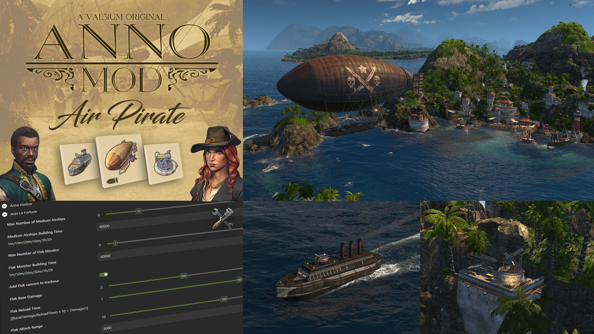
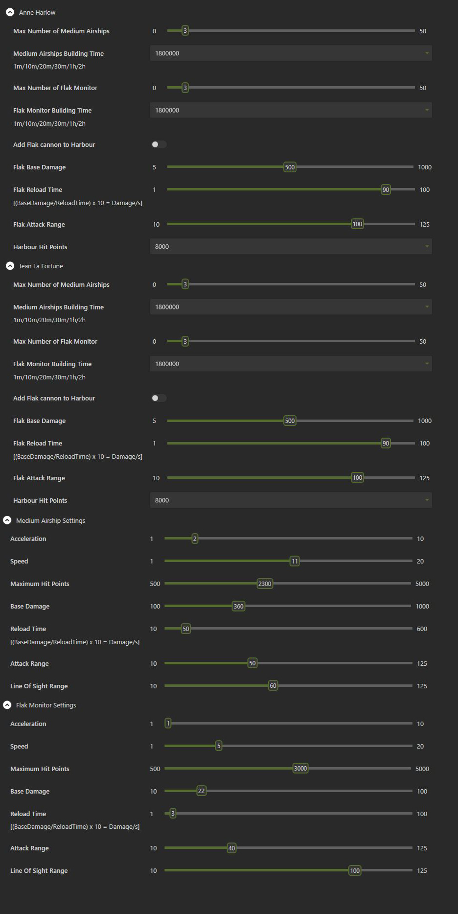

# Air Pirate

Add Airhip, Flak Tower and Flak Monitor to Pirates.

## Details

- Add a custom Armed Airship for pirates.
- Add the Flak Monitor to the pirate fleet.
- Add Flak defense to pirates islands. (Must use iMYA to activate it)
- By default, Airships and Flak Monitor spawn at a 30 minutes interval, until they get 3 of each. 
- Spawn interval and number of vehicle can be changed in iMYA. You can also balance the vehicles and Flak tower yourself.

## Requirements 

- You must have Empire of the Skies DLC to use this mod.

## Compatibility Issues

- EL IMPOLUTO  by StreaMRoLLeR
 
  This mod replace an entire profile used in many vanilla quests and can potentially break them, same goes for mods that use the profile in his vanilla state.
  Using it with my mods will result in one of them not working. 
  
## iMYA Tweaks

## Download

- Get [Air Pirate](https://github.com/VALiiiUM/Anno_1800_Mods/releases/tag/v1.02)
- Get [iModYourAnno](https://github.com/anno-mods/iModYourAnno/releases)

### Note

- Nothing yet. 
